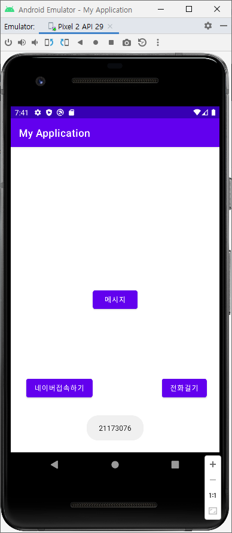
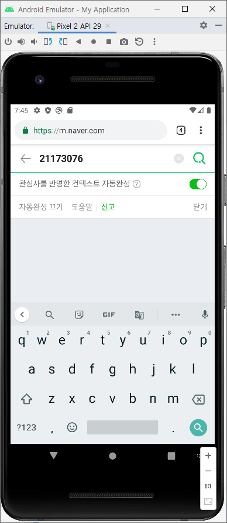
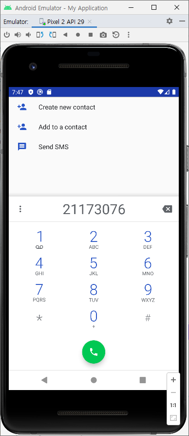
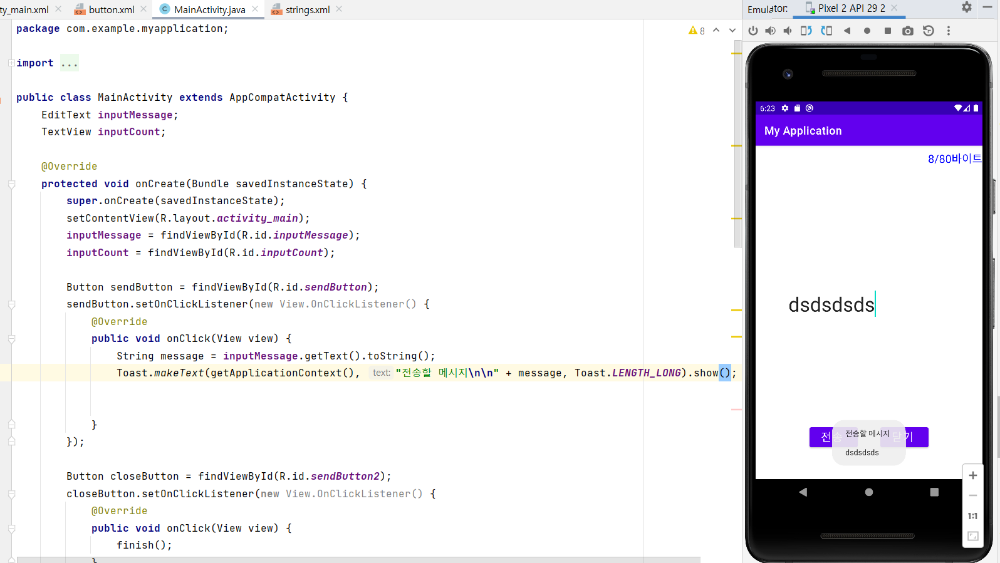
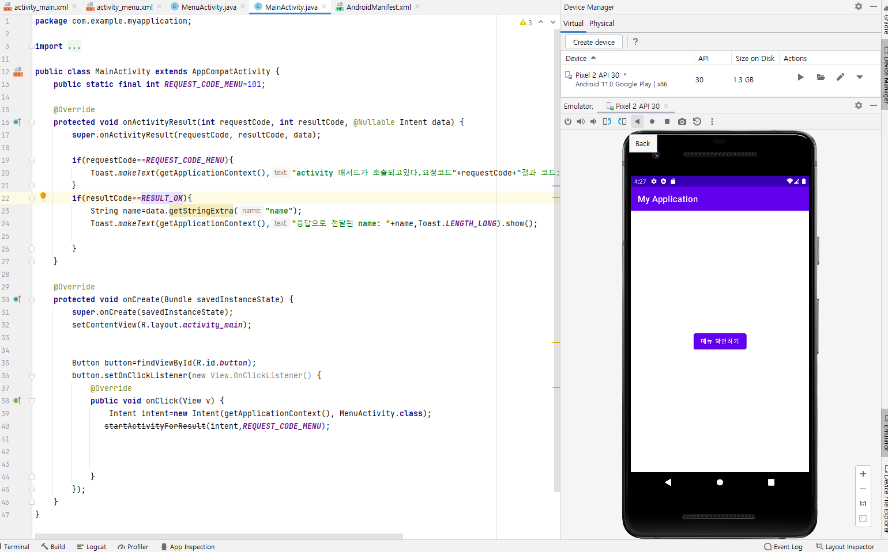
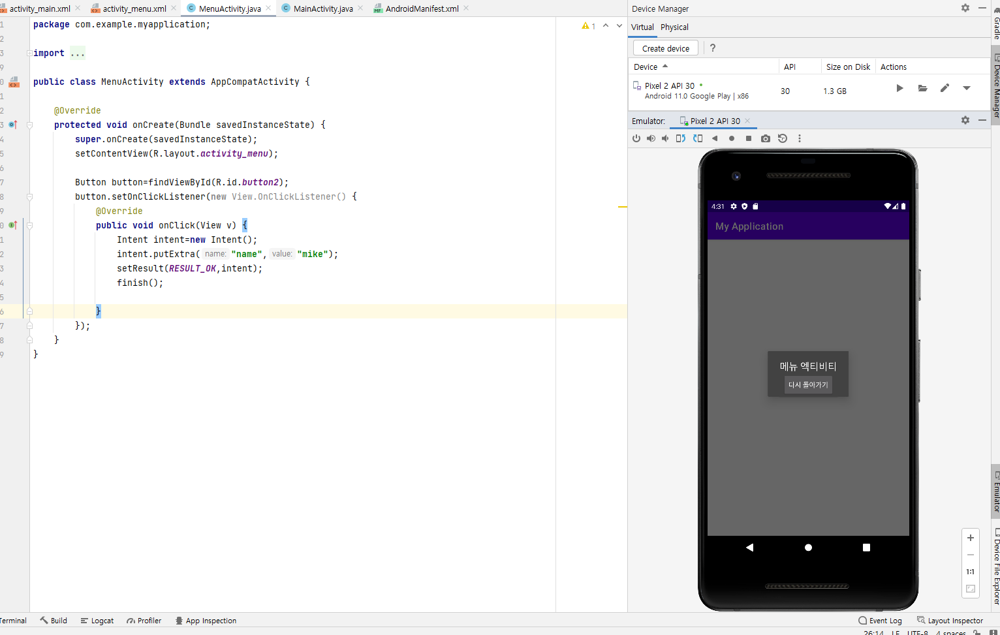
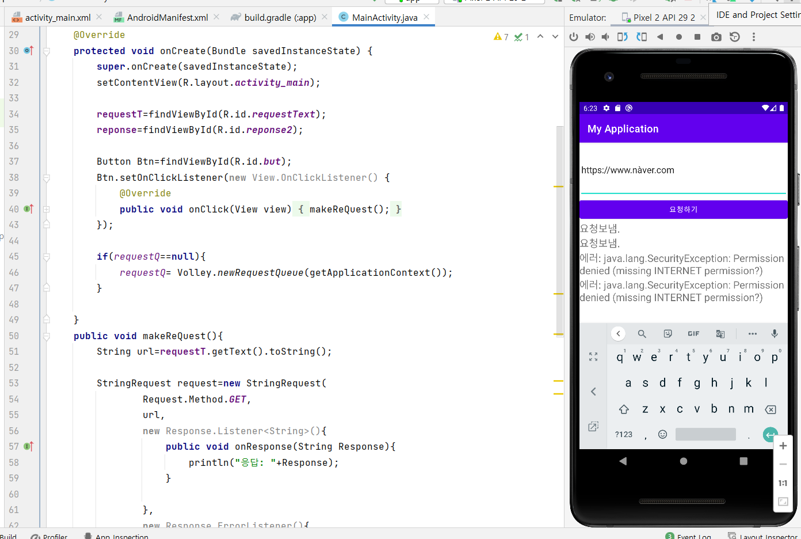
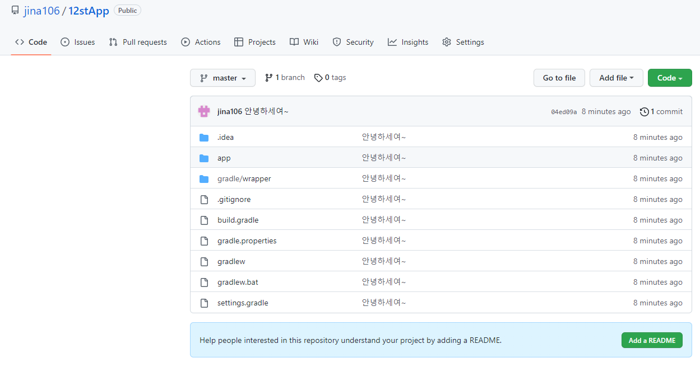
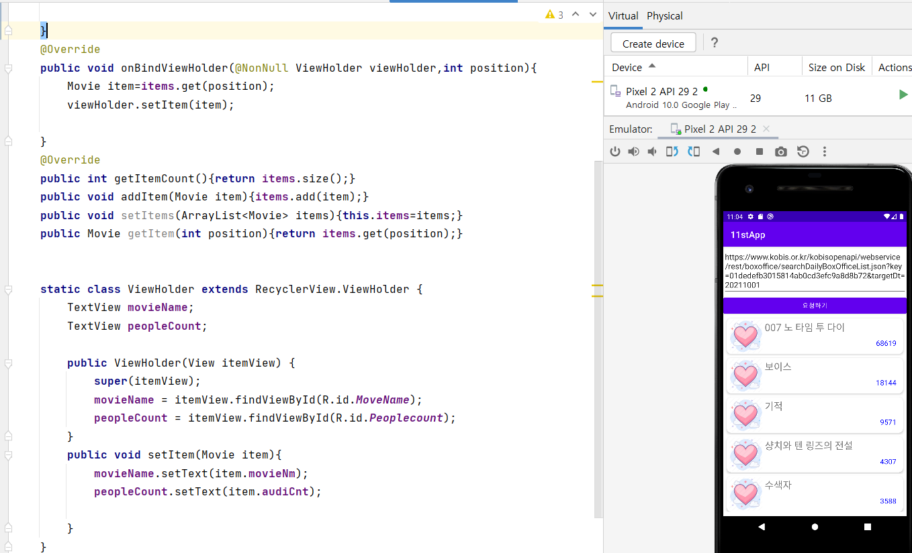

# IT_Class
**플랫폼 비즈니스**

☞ 2주차 과제\
</img>

☞ 3주차 과제\
</img>
</img>
</img>

☞ 5주차 과제\
</img>
</img>

☞ 6주차 과제\
</img>
</img>

☞ 9주차 과제\
</img>

☞ 10주차 과제\
</img>
</img>

☞ 11주차 과제\
</img>

☞ 12주차 과제\
</img>

☞ 13주차 과제\
</img>

☞ 14주차 과제\
</img>

